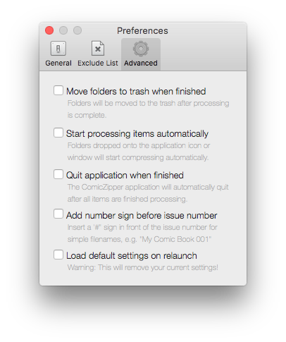

##Move folders to trash when finished
- Moves original folders to the trash after successful conversion to comic book archive.

##Start processing items automatically
- Dropped items are started automatically without further user input.
- Works well with Droplet mode.

##Quit application when finished
- ComicZipper automatically quits when all are items are finished processing.
- Works well with Droplet mode.

##Add number sign before issue number
- Adds a '#' sign in front of the issue number for simple filenames, e.g. "My Comic Book 001"
- Does not parse more complicated names for the issue number.
- Limited functionality in this release.

##Load default settings on relaunch
- Deletes the current user settings and restores default settings.

