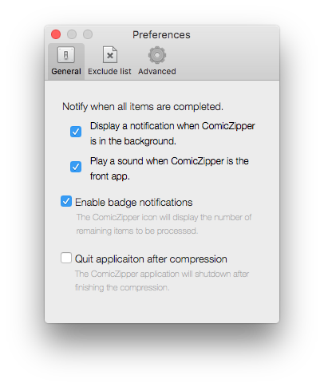

##Notify when all items are complete

Enable these options (ON by default) to be is notified after all items are finished processing by:

* An alert sound if ComicZipper is the frontmost app
* A Notification Center alert with sound if ComicZipper is in the background.

##Enable badge notifications

Provides user feedback for remaining items to process via an icon notification badge. The number of remaining items to process is displayed in a red circle on the icon in the dock and application switcher interface.

<video src="icon-badge.mov" AUTOPLAY="TRUE" LOOP="TRUE">
   Your browser does not support the HTML5 video element</video>

