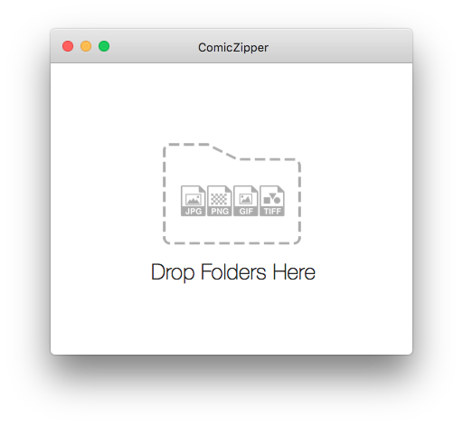
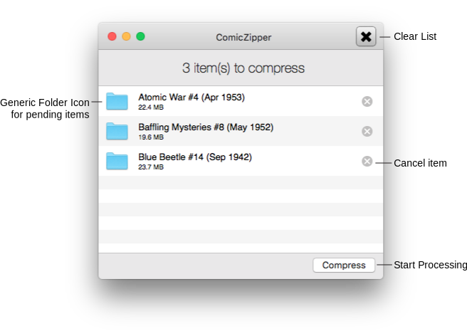
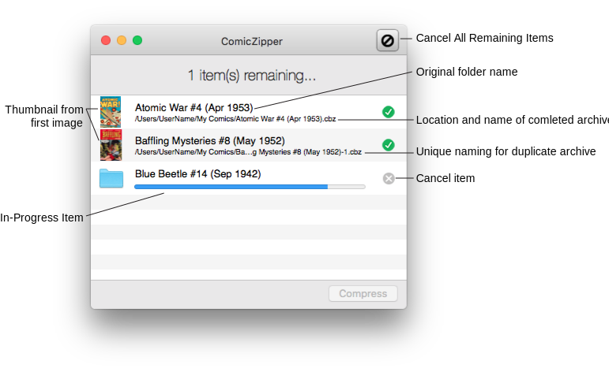
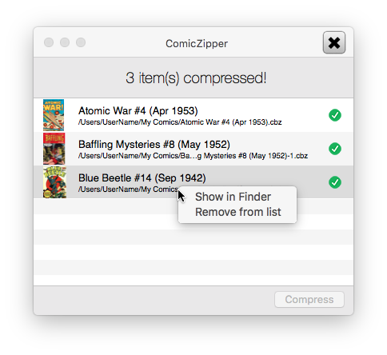

## Standard Application Mode
You can use ComicZipper as a standard application and drag folder(s) of images (usually scanned comic book pages) onto the target window. 

Folders must contain at least one image (in JPG, PNG, TIFF, BMP, or GIF format), but can also contain other non-image files, e.g. **nfo** text files, etc., used by various comic readers for additional information.

Extraneous operating system metadata files and hidden/empty files and subfolders are excluded by default (see ["Excluded List Settings"](settings-exclude.html)) to prevent issues with some comic readers.

A list of the dropped folders that can be processed will be displayed in the application window. 

If "Start processing items automatically" is not enabled in ["Advanced Settings"](settings-advanced.html), press the **Compress** button to start converting the folders to comic book zip archives (CBZ files) that can be read in any number of comic reader apps.

A progress meter will display for the currently processing item. 

A green checkmark  indicates the archive was converted successfully. Additionally, the first image in the folder will be used a cover thumbnail for the item in the ComicZipper app replacing the default folder image. *Note: this is not a custom icon used in the Finder, but rather feedback on successful archive creation inside the ComicZipper app.*

The resulting comic book zip archive (CBZ file) will be created in the same location  and have the same name (plus cbz extension) as the as the original folder. 

The full path and filename will be listed below the completed item in the application window.

In the case of pre-existing archives files with the same name in the same location, a number will be appended to the name, e.g. "My Comic Book-1.cbz". The number will be incremented as needed to ensure a unique filename. 

You can right-click or two-finger click on item to pull up a context menu for actions on the item: 

- Show in Finder
	- Shorcut: double-click item
- Remove from list
	- shortcut: press ⌫ (Delete key) 

Optionally (see ["Advanced Settings"](settings-advanced.html)), the original folder will be moved to Trash after successful conversion.

